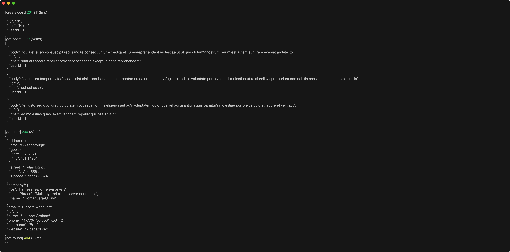
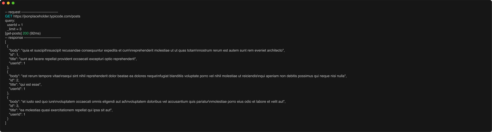

# resto

Resto is a simple cli app for testing REST services. It's kind of like curl, but focused on REST operations. It's still
in its infancy, but the goal is to be simple, useful, and have sane default behavior. I created this tool as an answer
to the frustations I experienced with Postman and Jetclient. As I was thinking about alternatives I asked myself,
"Why can't this just be a CLI?" and then presto there was resto. 

## Installation
No packages are available yet so you'll need to install it manually. Clone the repo, then run `cargo install --path .`

## Usage

It's pretty simple, you create a toml file that defines your operations and then you give the file to resto.

You can do some cool stuff like this:
```toml
[vars]
base_url = "https://jsonplaceholder.typicode.com"

[create-post]
method = "POST"
url = "{{base_url}}/posts"
body = """
{
  "title": "Hello",
  "userId": 1
}
"""

[get-user]
description = "Fetch a user"
method = "GET"
url = "{{base_url}}/users/1"
expect_status = [200]

[get-posts]
method = "GET"
url = "{{base_url}}/posts"

[get-posts.query]
userId = "1"
_limit = "3"

[not-found]
description = "Born to fail"
method = "GET"
url = "{{base_url}}/users/999999"
expect_status = [404]
```

- Then you can run resto and have it run all the operations: `resto test.toml`.

- You can also tell resto to run a single operation: `resto test.toml get-posts`. 

- You can also tell resto to quiet its outputs: `resto test.toml -q`. It'll only output the operation name, code, and elapsed time.

- You can also tell resto to be really quiet (aka silent): `resto test.toml -Q`. Resto will only use the return code and produce no stdout. Just a 0 if all's swell or 1 otherwise.

- Finally, you can tell resto to shout it's output: `resto test.toml -v`. Resto will show you the resolved URL, body, and response. 

### Example Output

#### Normal Output


#### Quiet Output


#### Verbose Output
